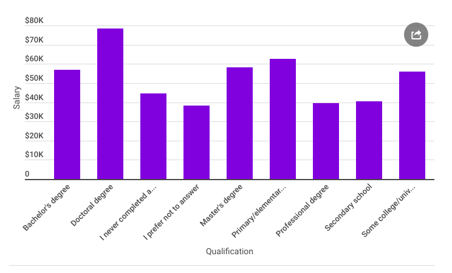
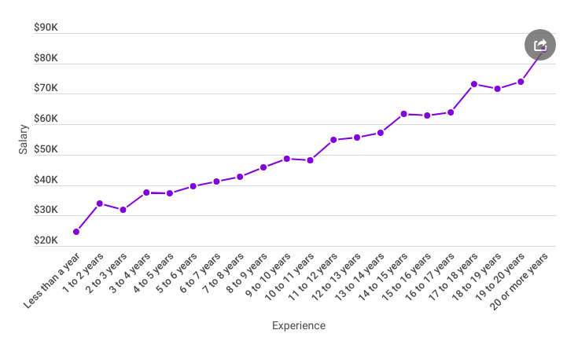
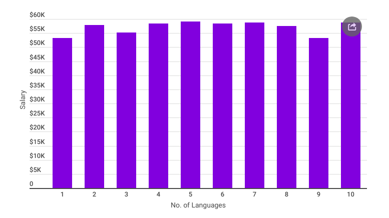

## Stack Overflow Developer Survey Results:

  

<h3 align="center"><a href='https://www.udacity.com/course/data-scientist-nanodegree--nd025'>Udacity Data Scientist Nanodegree Program</a></h3>
<h4 align="center">Project I: Write a Data Science Blog Post</h4>

## Objectives
- How education may influence the salary?
- Gender Ratio of developers across the globe
- The rate of increase in salary with the years of experience
- More Languages = More Money?

## Summary
### 1. How education may influence the salary?

The developers who own a Doctoral Degree get the highest salary of $78,527, followed by Primary/Elementary School graduates at $62,677 and Master's Degree holder at normal pay of $58,250.

### 2. Gender Ratio of developers across the globe

In this survey, only 2,595 females were recorded out of 34,140 responses which states that there are only 13 female developers over 100 male developers

### 3. The rate of increase in salary with the years of experience

With no surprise, the pattern is linear over the number of years of experience. Those very new to the tech industry, with less than a year of experience, can expect to get a normal pay of $24,673 (a year-over-year increment of 12.16 percent). Following a year or two, that normal pay hops to $33,953 (a whopping 37.6 percent expansion, year-over-year).

### 4. More Languages = More Money?

It doesn't make much difference at all. A developer specialized in one programming language get a normal pay of $53,202 whereas the one who is skilled in 9 different languages get a normal compensation of $53,301 (0.18% more).

### View a detailed analysis report on Medium

## Requirements
`pandas`, `matplotlib`, `jupyter-notebook` (if running locally)

## Installation 
You need to be able to work in a Jupyter Notebook on your computer. The following packages (libraries) need to be installed. You can install these packages via conda or pip.

- Numpy
- Pandas
- Matplotlib
- Seaborn
- jupyterthemes

You will need to download Stackoverflow’s 2017 and 2018 Annual Developer Survey and put in specific folders. You can find the data to download [here](https://insights.stackoverflow.com/survey). 

## Project Motivation 
This is a Udacity Nanodegree project. I was interested in using Stackoverflow Developer Survey Data to better understand

## Files in the repo
- `Stack Overflow Developer Survey.ipynb` - Analysis
- `survey_results_public.csv` - Developers Survey Result Data
- `survey_results_schema.csv` `reviews.csv` - Developers Survey Result Schema

## Licensing, Authors, Acknowledgements
Must give credit to Stackoverflow for the data. You can find the Licensing for the data and other descriptive information at the Stackoverflow link available [here](https://insights.stackoverflow.com/survey).

## Acknowledgements
### Data Source
- https://insights.stackoverflow.com/survey/

